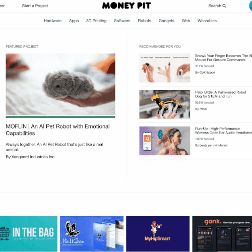

# Welcome to [MoneyPit](https://money-pit.herokuapp.com/)

## The Developers:
- [Brandon Held](https://brandonheld.netlify.app/)
- [Nick Litz](http://www.nicholaslitz.com/)
- [Steven Tegnelia](https://uribgp.com)
- [Tadeo Garcia](https://tadeogarcia.me)

## Table of Contents:
- [MoneyPit Overview](#moneypit-overview)
- [Application Architecture & Technologies Used](#application-architecture)
- [Front-end Overview](#front-end-overview)
- [Back-end Overview](#back-end-overview)
- [Moving Forward](#moving-forward)

## MoneyPit Overview

MoneyPit is a [Kickstarter](https://www.kickstarter.com/) inspired web app, focused on new promoting technology around the world!

The front-end portion was built using the React and Redux libraries in JavaScript, while the back-end was developed using the Flask framework in Python.

Users can explore projects by category, search using the searchbar, or just browse the front page.


## Application Architecture
MoneyPit is a fullstack Flask and React application. API calls are made to the Flask backend, and the responses are made available to the React components via the Redux store.

To deploy the app you simply need to have an updated build of the React Front-end, and run the docker file in the Back-end.


# Front-end Overview
## React
React components are used throughout the site to provide a seamless user interface, whether that be navigating from project to project, searching for a project, or browsing projects by category. 


## Redux
Redux, react-redux, and redux-thunk are the foundation that manage the application's state, and provide requests and responses between React and Flask.

Depending on the page, project information is fetched on the page load and then stored in the Redux store. This allows the user to refresh the page and have the information persist.

Additionally, there is an animation whenever a user successfully pledges to a project, which is achieved by using the React-confetti module.


The following code demonstrates how the confetti is rendered only after a succesful pledge has been submitted. The component renders a pledge button only when a user is logged in, otherwise the user is redirected to login. Additionally the minimum pledge is set upon rendering, and error handling prevents the user from donating an amount under that minimum.  Timeouts and page-scroll animations ensure that the user's vision is focused on the confetti, and the update of the total backing amount after their pledge has been received. This reward component updates the backend with the new pledge amount, and rerenders the parent component to show the real time update.

## Front-end Code Snippets:
```
const handleSubmit = e => { 
  e.preventDefault(); 
  const confetti = new ConfettiGenerator(confettiSettings) confetti.render() 
  setAnimateStyle(style) 
  setTimeout(()=> { 
    dispatch(sendPledge(pledge, user_id, project_id, reward_id)) setAnimateStyle({ color:'#028858'}) confetti.clear() 
  },3500) 
}

return (
    <div id="pledge_info">
      <div className="pledge_amount">
        <span id='pledge_amount-title'>
        Pledge ${minimum_donation} or more
        </span>
      </div>
      <div className="pledge_title">
          {title}
      </div>
      <div className="pledge_reward">
          <p>{description}</p>
      </div>
      <div className="delivery-card">
      <span id='reward-gray' className="pledge_title"> ESTIMATED DELIVERY</span>
        <br/>
        {delivery_date}
        <br/>
      <span id='reward-gray'> {reward_count} backers </span>
      </div>
      <div className="pledge-button">
        <form >
            <label htmlFor='pledge' 
            id='pledge-amount'>
              Pledge Amount
            </label>
            <input min={minimum_donation} 
            type="number"
            className='reward-pledge-input' 
            name="pledge" 
            value={pledge} 
            onChange={handleChange} required/>
            <div id='reward-pledge-button'>
              {user_id ? (
                <Link to='projectpage-top' id='reward-pledge-button' 
                onClick={handleSubmit} 
                smooth={true} duration={500}>
                   Pledge
                </Link>
              ):(
                <a href='/login' id='reward-pledge-button' >
                   Login to Pledge
                </a>
              )}
            </div>
        </form>
      </div>
    </div>
)
```

Redux also stores and sets the information of the user that is currently logged in. This allows for different functionality across the site depending on if the user is authenticated. By storing the user's information in state, they have access to their created or backed projects. These projects, which are just a click away, show up in the user modal which is accesible throughout the whole site.



# Back-end Overview
MoneyPit uses a Flask server in tandem with a Postgres database.  In comparison to the frontend, our backend is fairly simple.  Requests are received from the Redux store after a React component dispatches an action, the data is retrieved from the PSQL database and then returned to the Redux store where it is set in the state.

## Back-end Technologies
Flask was used to create our back-end server, and PostgresSQL our relational database.  SQLAlchemy was used to create the models, and their relationships.  Migrations were handled using Alembic.  

## MoneyPit Dataset
We created a seed file by scraping real Kickstarter projects.  Information which was not available from scraping, such as Pledge values and Rewards, were faked using several lists and assigning them based on different tier levels.  

<!-- # Code Snippets:
- [insert code snippets] -->

## Moving Forward
The next step for MoneyPit would be to implement AWS so that users can upload pictures for their projects, and their profile pictures.
Additionally we would like to integrate a service such as Stripe in order to securely process pledge transactions. 
Lastly, we would like to expand on the projects section in order to provide a place for community comments on the projects, if you have backed it.

### Thanks!
If you made it this far thank you so much for taking the time to read this, we really appreciated it! We had a great time working on this project as a team and look forward to adding more features in the future.

### Credits:
* Pictures and data are from https://apify.com/jaroslavhejlek/kickstarter-search
* Default category pictures from www.unsplash.com
